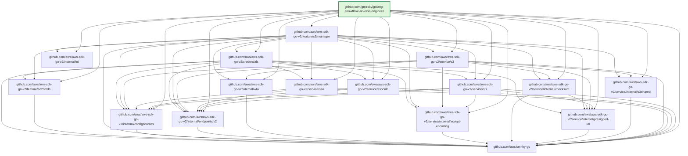
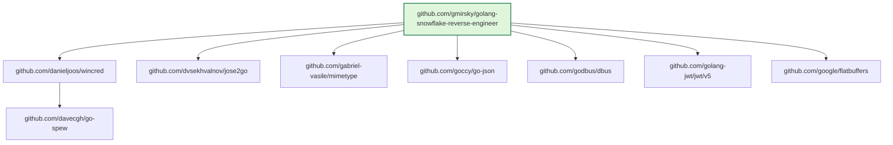
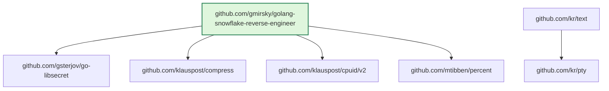
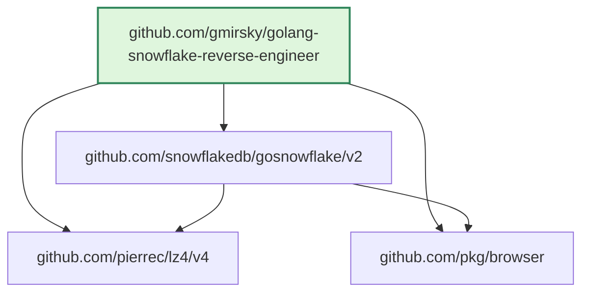
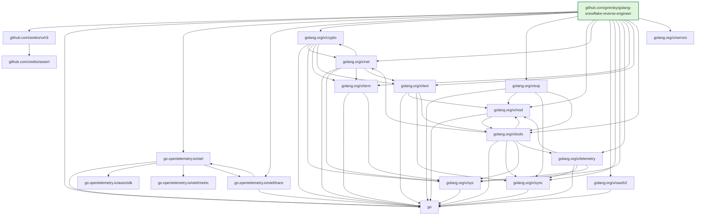
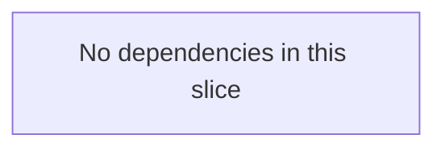

# golang-snowflake-reverse-engineer

`golang-snowflake-reverse-engineer` is a command-line tool that connects to Snowflake with key-pair authentication, walks every view in the target database's `INFORMATION_SCHEMA` schema, and writes one `.sql` file per view.

For each row in a view, the tool attempts to derive a Snowflake object identity and fetch its DDL with `GET_DDL`. If the row shape does not map cleanly to a supported object, the tool writes a deterministic SQL comment containing the row metadata instead. If a view has no rows, the tool writes:

```sql
/* No data found in the view <view name> */
```

## Requirements

- Go `1.26+` for native builds
- A Snowflake user configured for key-pair authentication
- An RSA private key file in a format supported by the Go SSH parser
- Access to the target database and its `INFORMATION_SCHEMA`

## Prerequisite tools

Install these tools before running build and test workflows.

### Required for core build and tests

- Go (`1.26+`)
  - Used by `go build`, `go test`, integration tests, and dependency graph generation.
  - Quick check: `go version`
- Bash (`4+` recommended)
  - All maintenance scripts in `scripts/` are Bash scripts.
  - Quick check: `bash --version`
- bats-core
  - Required for script test suites in `scripts/*.bats` and `task test-bats`.
  - Quick check: `bats --version`
- Task (go-task)
  - Required if you use `task ...` workflows from `Taskfile.yml`.
  - You can run equivalent raw commands manually if Task is not installed.
  - Quick check: `task --version`
- OpenSSL
  - Required to generate and inspect RSA key-pair files for Snowflake auth.
  - Quick check: `openssl version`
- curl
  - Required by `scripts/update_github_actions.sh` for GitHub API calls.
  - Quick check: `curl --version`
- Perl
  - Required by in-place replacement logic in `scripts/rename_module_path.sh` and `scripts/update_chainguard_images.sh`.
  - Quick check: `perl -v`

### Required for specific workflows

- Docker with Buildx
  - Required for `task docker-build` and `scripts/update_chainguard_images.sh`.
  - Quick checks: `docker --version` and `docker buildx version`
- Podman
  - Required for `task podman-build` and Podman container workflows.
  - Quick check: `podman --version`
- govulncheck
  - Used for vulnerability scanning.
  - `task vuln` installs it automatically if missing.

### Platform notes

- macOS (Homebrew)
  - Typical install set: `brew install go task bats-core openssl curl perl`
  - Docker and Podman are installed separately via their apps/package casks.
- Ubuntu/Debian
  - Typical install set: `sudo apt-get install golang-go bats curl perl openssl`
  - Install Task from go-task docs or via package manager if available on your distro version.
- Windows
  - Recommended: use WSL2 Ubuntu for full Bash + bats compatibility.
  - Native PowerShell/CMD execution is not the primary script target for this repository.

### Tips and hints

- Prefer Task targets for consistency: `task test`, `task test-bats`, `task test-integration`.
- Integration tests need live Snowflake credentials (`SNOWFLAKE_*` env vars).
- Set `GITHUB_TOKEN` before running actions checks/updates to reduce GitHub API rate-limit failures.
- `rg` (ripgrep) is optional but recommended; scripts automatically use it when available for faster file discovery.
- If `bats` is missing, run `task test` first for Go/unit checks, then add bats-core and run `task test-bats`.

### Quick verification

Run this once from your shell to verify required tools are available:

```bash
for cmd in go bash bats task openssl curl perl; do
  if command -v "$cmd" >/dev/null 2>&1; then
    printf 'ok: %s -> %s\n' "$cmd" "$(command -v "$cmd")"
  else
    printf 'missing: %s\n' "$cmd"
  fi
done
```

Check optional workflow tools:

```bash
for cmd in docker podman rg; do
  if command -v "$cmd" >/dev/null 2>&1; then
    printf 'optional ok: %s -> %s\n' "$cmd" "$(command -v "$cmd")"
  else
    printf 'optional missing: %s\n' "$cmd"
  fi
done

if command -v docker >/dev/null 2>&1; then
  docker buildx version || echo 'docker buildx plugin is missing'
fi
```

## CLI usage

```bash
go run ./cmd/snowflake-reverse-engineer \
  --user demo_user \
  --account demo_account \
  --warehouse demo_wh \
  --database demo_db \
  --output-dir ./output \
  --log-dir ./logs \
  --private-key ./keys/rsa_key.p8 \
  --max-connections 3 \
  --timestamped-output \
  --verbose
```

### Flags

- `--user`: Snowflake user name
- `--account`: Snowflake account identifier
- `--warehouse`: Snowflake warehouse name
- `--database`: Snowflake database name
- `--output-dir`: Directory path for generated SQL files
- `--log-dir`: Directory path for the log file
- `--private-key`: Directory path and file name of the private key file
- `--max-connections`: Optional. Default `3`, minimum `1`, maximum `9`
- `--passphrase`: Optional. Private key passphrase. Defaults to empty
- `--compact-packages`: Optional. Groups `INFORMATION_SCHEMA.PACKAGES` rows by package name, version, and language, and emits one line with a runtime list per group
- `--compact-packages-max-runtimes`: Optional. Caps runtimes shown per compact package group. Default `0` (unlimited)
- `--compact-packages-omit-truncation-count`: Optional and enabled by default. Omits the `(truncated, N more)` suffix when runtime capping is active
- `--timestamped-output`: Optional. Appends the run timestamp to output and log file names
- `--verbose`: Optional. Enables extra runtime logging

## Output behavior

- One file is generated for each view in `<database>.INFORMATION_SCHEMA`
- Processing is concurrent, limited by `--max-connections`
- `PACKAGES` output can be compacted with `--compact-packages` to reduce very large files
- Use `--compact-packages-max-runtimes` with `--compact-packages` to keep each package line shorter when many runtimes exist
- `(truncated, N more)` suffixes are omitted by default to minimize bytes when runtime capping is enabled
- `storage_integrations.sql` is always written. It contains a `CREATE STORAGE INTEGRATION IF NOT EXISTS` statement for every storage-type integration found via `SHOW INTEGRATIONS` + `DESC STORAGE INTEGRATION`. If no storage integrations exist the file contains a `/* No data found */` comment. Read-only Snowflake-managed properties (`STORAGE_AWS_IAM_USER_ARN`, `STORAGE_AWS_EXTERNAL_ID`, `AZURE_CONSENT_URL`, `AZURE_MULTI_TENANT_APP_NAME`, `STORAGE_GCP_SERVICE_ACCOUNT`) are excluded from the generated DDL.
- The log file records:
  - all input parameters with the passphrase redacted
  - the row count for each processed view
  - the number of SQL statements generated per view
  - a run summary

## Generating a key pair

Snowflake key-pair authentication requires a PKCS#8 RSA private key and the corresponding public key registered on the Snowflake user.

### Generate an unencrypted private key

```bash
mkdir -p keys
openssl genrsa 4096 | openssl pkcs8 -topk8 -inform PEM -out keys/rsa_key.p8 -nocrypt
chmod 600 keys/rsa_key.p8
```

### Generate a passphrase-protected private key

```bash
mkdir -p keys
openssl genrsa 4096 | openssl pkcs8 -topk8 -inform PEM -out keys/rsa_key.p8
chmod 600 keys/rsa_key.p8
```

OpenSSL will prompt for a passphrase. Pass the same value to the tool via `--passphrase` at runtime.

### Derive the public key

```bash
openssl rsa -in keys/rsa_key.p8 -pubout -out keys/rsa_key.pub
```

### Register the public key with Snowflake

Strip the PEM header/footer lines, then set the key on your Snowflake user:

```sql
ALTER USER demo_user SET RSA_PUBLIC_KEY='<contents of keys/rsa_key.pub minus header and footer lines>';
```

You can extract just the key body with:

```bash
grep -v "^-----" keys/rsa_key.pub | tr -d '\n'
```

Paste the output as the value inside the single quotes in the `ALTER USER` statement.

## Native development

```bash
go mod tidy
go test ./...
bats ./scripts/*.bats
govulncheck ./...
go build ./cmd/snowflake-reverse-engineer
```

If `govulncheck` is not installed locally, install it with:

```bash
go install golang.org/x/vuln/cmd/govulncheck@latest
```

## Taskfile usage

This repository includes a `Taskfile.yml` for common development workflows.

Build the project binary:

```bash
task build
```

Run tests:

```bash
task test
```

Run bats-core tests for maintenance scripts:

```bash
task test-bats
```

Current bats-core script test coverage:

- `scripts/check_comment_style.bats` validates exported-comment style checks
- `scripts/update_chainguard_images.bats` validates digest check/update behavior
- `scripts/update_github_actions.bats` validates action version check/update behavior
- `scripts/rename_module_path.bats` validates module path rewrite behavior
- `scripts/generate_module_dependency_diagram.bats` validates diagram generation/update behavior

Run integration tests against a live Snowflake account:

```bash
task test-integration
```

Run the CLI locally with arguments:

```bash
task run -- --user demo_user --account demo_account --warehouse demo_wh --database demo_db --output-dir ./output --log-dir ./logs --private-key ./keys/rsa_key.p8
```

Other available tasks:

```bash
task tidy
task comment-check
task test-bats
task test-integration
task vuln
task image-check
task image-update
task actions-check
task actions-update
task module-rename -- github.com/example/golang-snowflake-reverse-engineer
task module-diagram-print
task module-diagram-update
task docker-build
task podman-build
task clean
```

### Updating pinned Chainguard image digests

The repository includes `scripts/update_chainguard_images.sh` to keep pinned
Chainguard image digests in `Dockerfile` and `Containerfile` up to date.

Check only (no file changes). Exits `1` when digests are out of date:

```bash
bash ./scripts/update_chainguard_images.sh --check
```

Update both files in place when newer digests are available:

```bash
bash ./scripts/update_chainguard_images.sh --update
```

Equivalent optional Taskfile wrappers:

```bash
task image-check
task image-update
```

### Updating GitHub Actions versions in workflow YAML files

The repository includes `scripts/update_github_actions.sh` to check and update
action versions referenced by YAML files in `.github/workflows/`.

Check only (no file changes). Exits `1` when one or more actions are out of date:

```bash
bash ./scripts/update_github_actions.sh --check
```

Update action references in place to latest stable release tags:

```bash
bash ./scripts/update_github_actions.sh --update
```

Equivalent optional Taskfile wrappers:

```bash
task actions-check
task actions-update
```

### Renaming the Go module path for template use

The repository includes `scripts/rename_module_path.sh` to rewrite the current
module path from `go.mod` across repository text files such as Go source,
docs, and maintenance scripts.

Preview the files that would change:

```bash
bash ./scripts/rename_module_path.sh --dry-run github.com/example/golang-snowflake-reverse-engineer
```

Apply the rename in place:

```bash
bash ./scripts/rename_module_path.sh github.com/example/golang-snowflake-reverse-engineer
```

Equivalent optional Taskfile wrapper:

```bash
task module-rename -- github.com/example/golang-snowflake-reverse-engineer
```

### Script maintenance notes

The `scripts` directory contains small automation helpers that are safe to run
locally and in CI. Use this section as a quick maintenance guide.

`scripts/check_comment_style.sh`

- Purpose: Enforces exported Go function doc comments to include a
  `// <FuncName>:` prefix and the `Given` / `when` / `then` keywords.
- Inputs: Scans all `.go` files in the repository (uses `rg` when available,
  otherwise falls back to `find`).
- Exit codes:
  - `0`: all files pass.
  - `1`: one or more style violations were found.

`scripts/update_chainguard_images.sh`

- Purpose: Checks or updates pinned Chainguard image digests in
  `Dockerfile` and `Containerfile`.
- Modes:
  - `--check`: reports drift and exits non-zero when digests are out of date.
  - `--update`: updates both files in place when newer digests exist.
- Requirements: Docker with `buildx` support.
- Exit codes:
  - `0`: up to date or successfully updated.
  - `1`: required tool missing or drift detected in check mode.
  - `2`: invalid CLI arguments.

`scripts/update_github_actions.sh`

- Purpose: Checks or updates `uses:` references in YAML files under `.github/workflows/`
  to latest stable GitHub release tags.
- Modes:
  - `--check`: reports outdated action refs and exits non-zero when drift exists.
  - `--update`: updates outdated refs in place.
- Requirements: `curl` (and optional `GITHUB_TOKEN` to reduce GitHub API
  rate-limit issues).
- Exit codes:
  - `0`: up to date or successfully updated.
  - `1`: required tool missing, API lookup failure, or drift in check mode.
  - `2`: invalid CLI arguments.

`scripts/rename_module_path.sh`

- Purpose: Rewrites the current Go module path from `go.mod` across repository
  text files for fork/template workflows.
- Modes:
  - `--dry-run`: prints files that would be updated without changing them.
- Requirements: `perl` available in `PATH` (`rg` is used when available,
  otherwise the script falls back to `find`).
- Notes: Skips generated/runtime directories such as `bin/`, `logs/`,
  `output/`, and `keys/`.
- Exit codes:
  - `0`: rename succeeded, dry run succeeded, or no matching files were found.
  - `1`: required tools/files missing or replacement failed.
  - `2`: invalid CLI arguments.

`scripts/generate_module_dependency_diagram.sh`

- Purpose: Generates multiple Mermaid dependency diagrams from `go mod graph`
  (direct dependencies plus chunked transitive dependencies) and updates the
  managed module graph block in `README.md`.
- Modes:
  - `--print`: prints generated Mermaid content to stdout.
  - `--update-readme`: updates the managed diagram block in place.
  - `--chunk-size N`: sets max nodes per transitive chunk diagram
    (default: `20`).
- Requirements: Go toolchain available in `PATH`.
- Exit codes:
  - `0`: diagram generated successfully.
  - `1`: required tools/files missing.
  - `2`: invalid CLI arguments.

## Container build

Build for the current platform:

```bash
docker build -t snowflake-reverse-engineer:local .
```

Build for multiple platforms with `buildx`:

```bash
docker buildx build \
  --platform linux/amd64,linux/arm64 \
  -t snowflake-reverse-engineer:multi \
  .
```

Load a single target platform into the local Docker image store:

```bash
docker buildx build \
  --platform linux/amd64 \
  --load \
  -t snowflake-reverse-engineer:amd64 \
  .
```

### Podman build

Build using the repository `Containerfile` and `.containerignore`:

```bash
podman build \
  -f Containerfile \
  --ignorefile .containerignore \
  -t snowflake-reverse-engineer:podman \
  .
```

Build for a specific architecture:

```bash
podman build \
  -f Containerfile \
  --ignorefile .containerignore \
  --arch amd64 \
  -t snowflake-reverse-engineer:podman-amd64 \
  .
```

## Container run

Mount directories for the private key, logs, and output files:

```bash
docker run --rm \
  -v "$PWD/keys:/keys:ro" \
  -v "$PWD/output:/output" \
  -v "$PWD/logs:/logs" \
  snowflake-reverse-engineer:local \
  --user demo_user \
  --account demo_account \
  --warehouse demo_wh \
  --database demo_db \
  --output-dir /output \
  --log-dir /logs \
  --private-key /keys/rsa_key.p8 \
  --max-connections 3
```

If the private key is encrypted, add `--passphrase` to the container command.

### Podman run

Run with the same mounts and arguments using Podman:

```bash
podman run --rm \
  -v "$PWD/keys:/keys:ro" \
  -v "$PWD/output:/output" \
  -v "$PWD/logs:/logs" \
  snowflake-reverse-engineer:podman \
  --user demo_user \
  --account demo_account \
  --warehouse demo_wh \
  --database demo_db \
  --output-dir /output \
  --log-dir /logs \
  --private-key /keys/rsa_key.p8 \
  --max-connections 3
```

## Notes on DDL generation

- The tool prefers `GET_DDL` for rows that clearly identify Snowflake objects such as tables, views, sequences, procedures, functions, tasks, stages, pipes, streams, and file formats.
- Some `INFORMATION_SCHEMA` views describe metadata rather than first-class objects. In those cases, the tool writes a SQL comment with the row payload so every row still produces deterministic output.

## Go module dependency diagram

This diagram set is generated from `go mod graph`.
Run the script from the repository root:

```bash
# Print the generated Mermaid diagram to stdout
bash ./scripts/generate_module_dependency_diagram.sh --print

# Regenerate and write the managed diagram block in README.md
bash ./scripts/generate_module_dependency_diagram.sh --update-readme

# Regenerate with smaller transitive chunks for easier viewing
bash ./scripts/generate_module_dependency_diagram.sh --update-readme --chunk-size 20
```

Equivalent optional Taskfile wrappers:

```bash
task module-diagram-print
task module-diagram-update
```

<!-- MODULE_DEP_GRAPH_START -->
### 1) Direct Dependencies

```mermaid
flowchart TD
  classDef root fill:#dff6dd,stroke:#2f855a,stroke-width:2px
  N1["github.com/99designs/go-keychain"]
  N2["github.com/99designs/keyring"]
  N3["github.com/Azure/azure-sdk-for-go/sdk/azcore"]
  N4["github.com/Azure/azure-sdk-for-go/sdk/internal"]
  N5["github.com/Azure/azure-sdk-for-go/sdk/storage/azblob"]
  N6["github.com/BurntSushi/toml"]
  N7["github.com/apache/arrow-go/v18"]
  N8["github.com/aws/aws-sdk-go-v2"]
  N9["github.com/aws/aws-sdk-go-v2/aws/protocol/eventstream"]
  N10["github.com/aws/aws-sdk-go-v2/config"]
  N11["github.com/aws/aws-sdk-go-v2/credentials"]
  N12["github.com/aws/aws-sdk-go-v2/feature/ec2/imds"]
  N13["github.com/aws/aws-sdk-go-v2/feature/s3/manager"]
  N14["github.com/aws/aws-sdk-go-v2/internal/configsources"]
  N15["github.com/aws/aws-sdk-go-v2/internal/endpoints/v2"]
  N16["github.com/aws/aws-sdk-go-v2/internal/ini"]
  N17["github.com/aws/aws-sdk-go-v2/internal/v4a"]
  N18["github.com/aws/aws-sdk-go-v2/service/internal/accept-encoding"]
  N19["github.com/aws/aws-sdk-go-v2/service/internal/checksum"]
  N20["github.com/aws/aws-sdk-go-v2/service/internal/presigned-url"]
  N21["github.com/aws/aws-sdk-go-v2/service/internal/s3shared"]
  N22["github.com/aws/aws-sdk-go-v2/service/s3"]
  N23["github.com/aws/aws-sdk-go-v2/service/sso"]
  N24["github.com/aws/aws-sdk-go-v2/service/ssooidc"]
  N25["github.com/aws/aws-sdk-go-v2/service/sts"]
  N26["github.com/aws/smithy-go"]
  N27["github.com/danieljoos/wincred"]
  N28["github.com/dvsekhvalnov/jose2go"]
  N29["github.com/gabriel-vasile/mimetype"]
  N30["github.com/gmirsky/golang-snowflake-reverse-engineer"]
  class N30 root
  N31["github.com/goccy/go-json"]
  N32["github.com/godbus/dbus"]
  N33["github.com/golang-jwt/jwt/v5"]
  N34["github.com/google/flatbuffers"]
  N35["github.com/gsterjov/go-libsecret"]
  N36["github.com/klauspost/compress"]
  N37["github.com/klauspost/cpuid/v2"]
  N38["github.com/mtibben/percent"]
  N39["github.com/pierrec/lz4/v4"]
  N40["github.com/pkg/browser"]
  N41["github.com/snowflakedb/gosnowflake/v2"]
  N42["github.com/zeebo/xxh3"]
  N43["go"]
  N44["go.opentelemetry.io/otel"]
  N45["go.opentelemetry.io/otel/trace"]
  N46["golang.org/x/crypto"]
  N47["golang.org/x/exp"]
  N48["golang.org/x/mod"]
  N49["golang.org/x/net"]
  N50["golang.org/x/oauth2"]
  N51["golang.org/x/sync"]
  N52["golang.org/x/sys"]
  N53["golang.org/x/telemetry"]
  N54["golang.org/x/term"]
  N55["golang.org/x/text"]
  N56["golang.org/x/tools"]
  N57["golang.org/x/xerrors"]
  N30 --> N1
  N30 --> N2
  N30 --> N3
  N30 --> N4
  N30 --> N5
  N30 --> N6
  N30 --> N7
  N30 --> N8
  N30 --> N9
  N30 --> N10
  N30 --> N11
  N30 --> N12
  N30 --> N13
  N30 --> N14
  N30 --> N15
  N30 --> N16
  N30 --> N17
  N30 --> N18
  N30 --> N19
  N30 --> N20
  N30 --> N21
  N30 --> N22
  N30 --> N23
  N30 --> N24
  N30 --> N25
  N30 --> N26
  N30 --> N27
  N30 --> N28
  N30 --> N29
  N30 --> N31
  N30 --> N32
  N30 --> N33
  N30 --> N34
  N30 --> N35
  N30 --> N36
  N30 --> N37
  N30 --> N38
  N30 --> N39
  N30 --> N40
  N30 --> N41
  N30 --> N42
  N30 --> N43
  N30 --> N44
  N30 --> N45
  N30 --> N46
  N30 --> N47
  N30 --> N48
  N30 --> N49
  N30 --> N50
  N30 --> N51
  N30 --> N52
  N30 --> N53
  N30 --> N54
  N30 --> N55
  N30 --> N56
  N30 --> N57
```



### 2) Transitive Dependencies (Chunked)

Transitive dependencies are split into chunks of up to 20 nodes for readability.

#### Chunk 1: Azure + AWS

```mermaid
flowchart TD
  classDef root fill:#dff6dd,stroke:#2f855a,stroke-width:2px
  N1["atomicgo.dev/cursor"]
  N2["atomicgo.dev/keyboard"]
  N3["atomicgo.dev/schedule"]
  N4["cloud.google.com/go"]
  N5["github.com/99designs/go-keychain"]
  N6["github.com/99designs/keyring"]
  N7["github.com/Azure/azure-sdk-for-go/sdk/azcore"]
  N8["github.com/Azure/azure-sdk-for-go/sdk/azidentity"]
  N9["github.com/Azure/azure-sdk-for-go/sdk/internal"]
  N10["github.com/Azure/azure-sdk-for-go/sdk/storage/azblob"]
  N11["github.com/AzureAD/microsoft-authentication-library-for-go"]
  N12["github.com/BurntSushi/toml"]
  N13["github.com/andybalholm/brotli"]
  N14["github.com/antlr4-go/antlr/v4"]
  N15["github.com/apache/arrow-go/v18"]
  N16["github.com/apache/thrift"]
  N17["github.com/aws/aws-sdk-go-v2"]
  N18["github.com/aws/aws-sdk-go-v2/aws/protocol/eventstream"]
  N19["github.com/aws/aws-sdk-go-v2/config"]
  N20["github.com/gmirsky/golang-snowflake-reverse-engineer"]
  class N20 root
  N6 --> N5
  N7 --> N9
  N10 --> N7
  N10 --> N8
  N10 --> N9
  N10 --> N11
  N15 --> N1
  N15 --> N2
  N15 --> N3
  N15 --> N4
  N15 --> N13
  N15 --> N14
  N15 --> N16
  N19 --> N17
  N20 --> N5
  N20 --> N6
  N20 --> N7
  N20 --> N9
  N20 --> N10
  N20 --> N12
  N20 --> N15
  N20 --> N17
  N20 --> N18
  N20 --> N19
```



#### Chunk 2: AWS + creasty



#### Chunk 3: Google + golang-jwt



#### Chunk 4: klauspost + modern-go



#### Chunk 5: tidwall + substrait-io



#### Chunk 6: Go x + OpenTelemetry



#### Chunk 7: toolchain + modernc.org/token



<!-- MODULE_DEP_GRAPH_END -->
